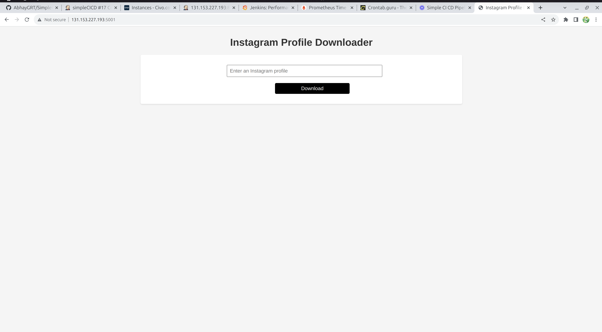

# Instagram Profile Downloader

This is a simple Flask web application that allows you to download content from Instagram profiles using Instaloader. 
Follow the instructions below to set up and run the application.

## Prerequisites

Before running the application, make sure you have the following installed:

1. Python 3: You can download it from [Python's official website](https://www.python.org/downloads/).

2. pip3: The Python package manager. You can usually install it alongside Python. To check if you have pip3 installed, run:

```
sudo apt install python3-pip
pip3 --version
```
If it's not installed, you can download and install it from here.

Flask: You can install Flask using pip3:

```
pip3 install Flask
```
Instaloader: You can install Instaloader using pip3:

```
  pip3 install instaloader
```

Running the Application
1. Clone this repository or download the project files to your computer.
2. Open a terminal or command prompt and navigate to the project directory.

Run the Flask application:

```
  python3 app.py
```

The Flask app should now be running locally. Open your web browser and access the following URL:

```
  http://localhost:5000
```


You should see the Instagram Profile Downloader web page. You can enter an Instagram profile name and click the "Download" button to download content from the specified profile.

For private profiles, provide your Instagram username and password when prompted.
